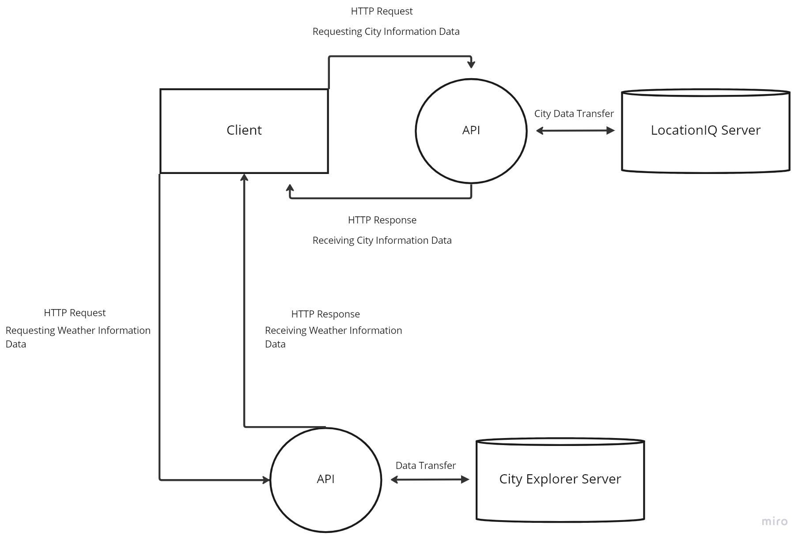

# city-explorer-api

**Author**: Matthew Austin
**Version**: 1.0.1

## Overview

This application is a backend server for the City Explorer app that communicates with several APIs to provide weather and movie information.

## Getting Started

Use `npm install` to add `express`, `dotenv`, and `cors`

## Architecture

- Node.js
- Express.js
- Axios
- dotenv
- CORS
- [Weatherbit API](https://www.weatherbit.io/)
- [The Movie Database API](https://www.themoviedb.org/settings/api)

## Change Log

1.0.0 - 01-28-2023 9:00pm - Initial deployment of static weather API capable server
1.0.1 - 02-02-2023 7:50pm - Deployment of dynamic weather API and movie database API to display weather and movies for searched city.

## Feature Time Estimates

### Setup React Repo & API Keys

Estimate of time needed to complete: 30 minutes

Start time: 2023-01-28T10:15-08:00

Finish time: 2023-01-28T10:45-08:00

Actual time needed to complete: 30 minutes

### Weather Placeholder

Estimate of time needed to complete: 5 hours

Start time: 2023-01-28T13:00-08:00

Finish time: 2023-01-28T19:00-08:00

Actual time needed to complete: 5 hours

### Errors Revisited

Estimate of time needed to complete: 5 hours

Start time: 2023-01-28T13:00-08:00

Finish time: 2023-01-28T19:00-08:00

Actual time needed to complete: 5 hours

### Weather Live

Estimate of time needed to complete: 3 hours

Start time: 2023-02-01T16:30-08:00

Finish time: 2023-01-28T19:15-08:00

Actual time needed to complete: 3 hours, 15 minutes

### Movies

Estimate of time needed to complete: 2 hours

Start time: 2023-02-02T16:30-08:00

Finish time: 2023-01-28T17:30-08:00

Actual time needed to complete: 1 hour
