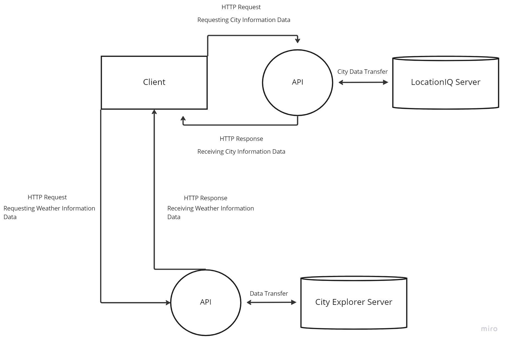

# city-explorer-api

**Author**: Matthew Austin
**Version**: 1.0.0

## Overview

This application is a backend server for the City Explorer app that communicates with several APIs to provide location, weather, and movie information.

## Getting Started

Use `npm install` to add `express`, `dotenv`, and `cors`

## Architecture

- Node.js
- Express.js
- dotenv
- CORS

## Change Log

01-28-2023 9:00pm - Initial deployment of static weather API capable server

## Credit and Collaborations
<!-- Give credit (and a link) to other people or resources that helped you build this application. -->

## Feature Time Estimates

### Setup React Repo & API Keys

Estimate of time needed to complete: 30 minutes

Start time: 2023-01-28T10:15-08:00

Finish time: 2023-01-28T10:45-08:00

Actual time needed to complete: 30 minutes

### Weather Placeholder

Estimate of time needed to complete: 5 hours

Start time: 2023-01-28T13:00-08:00

Finish time: 2023-01-28T19:00-08:00

Actual time needed to complete: 5 hours

### Errors Revisited

Estimate of time needed to complete: 5 hours

Start time: 2023-01-28T13:00-08:00

Finish time: 2023-01-28T19:00-08:00

Actual time needed to complete: 5 hours
